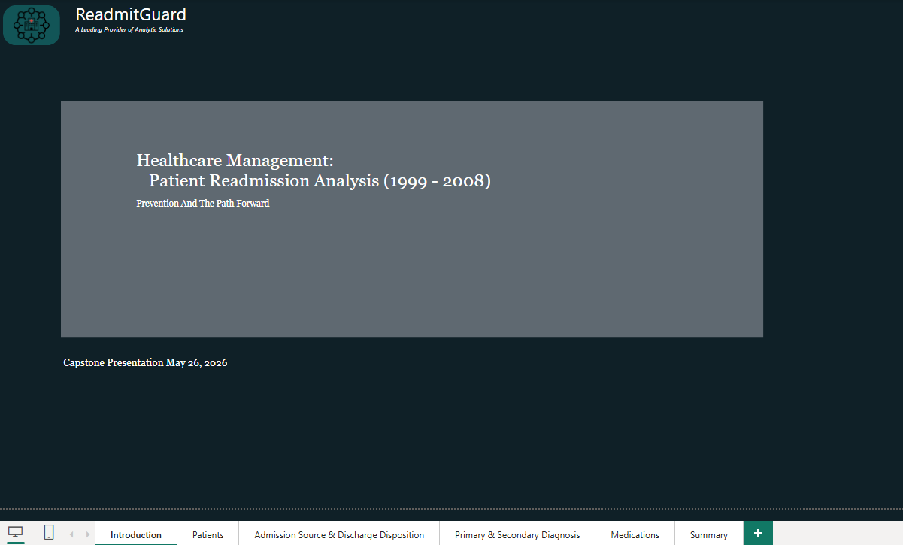
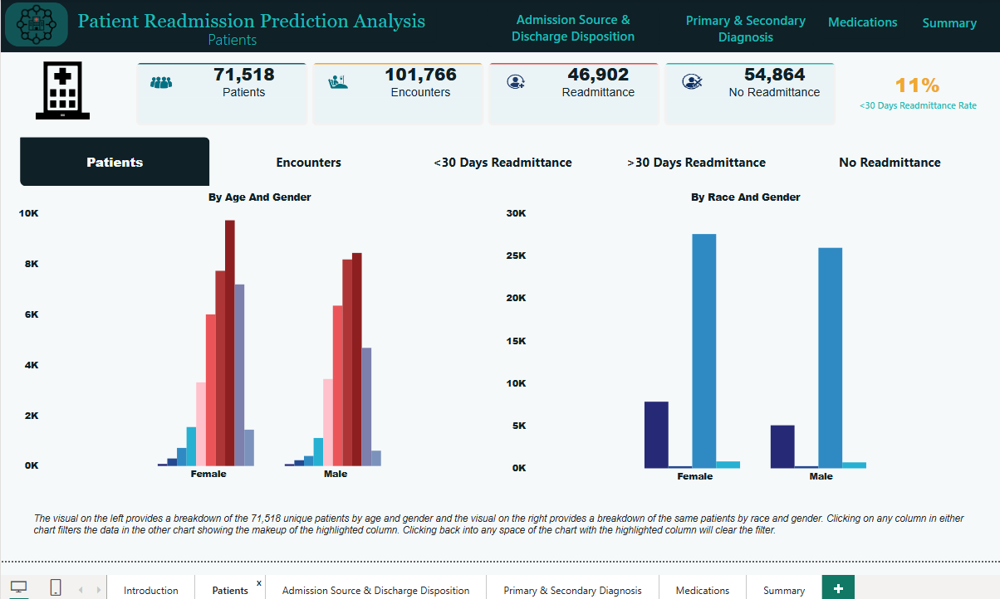
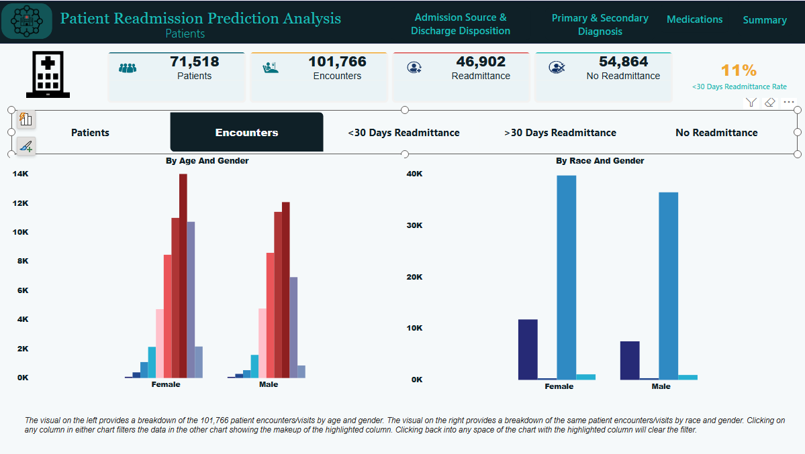
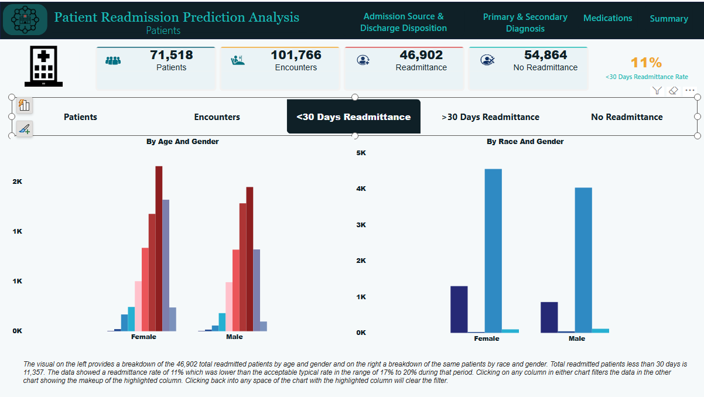
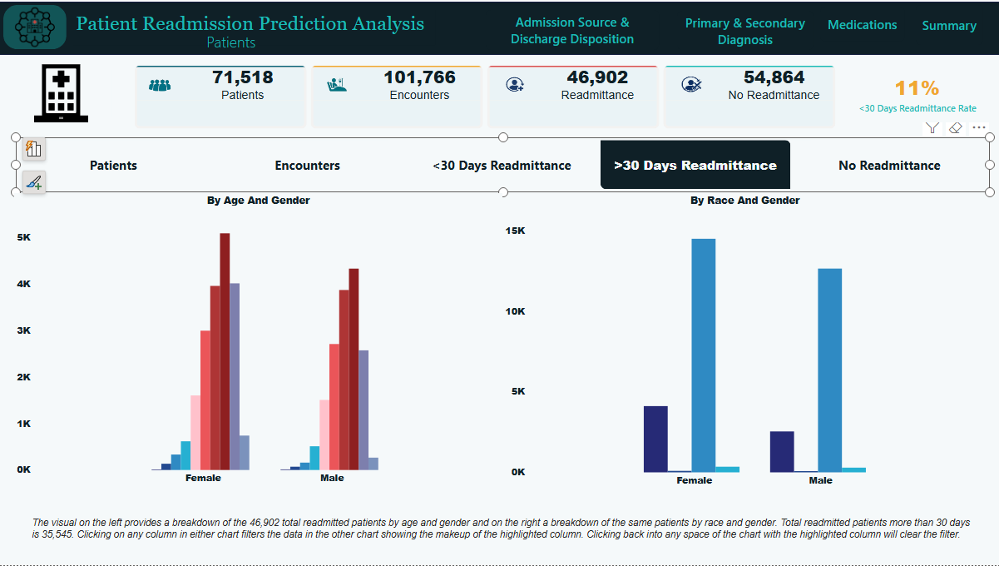
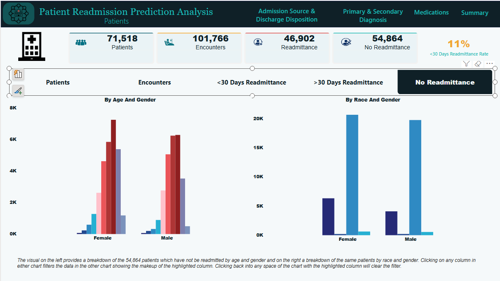
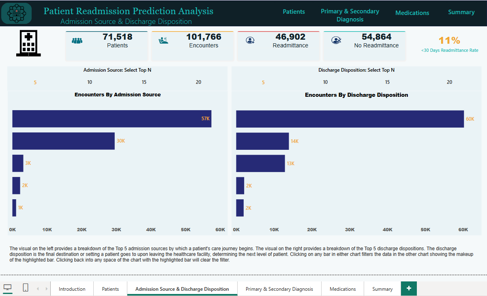
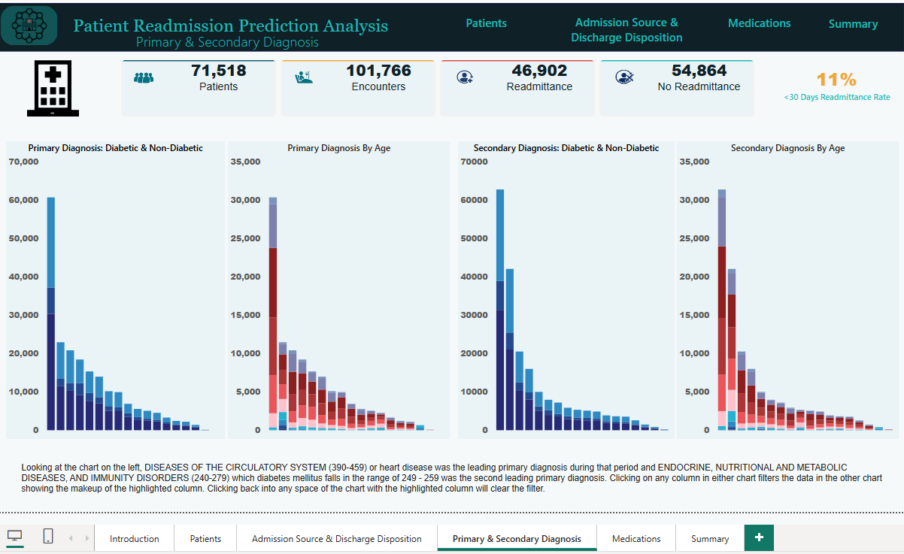
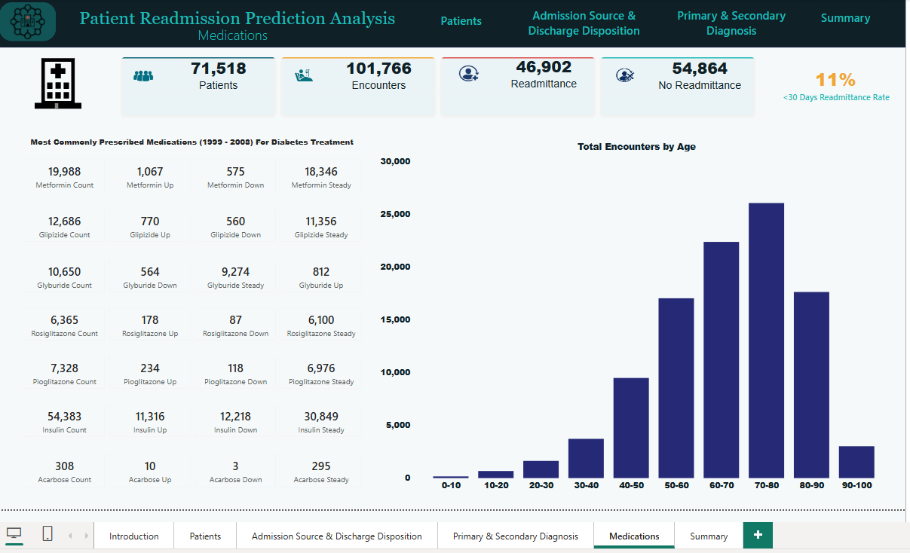
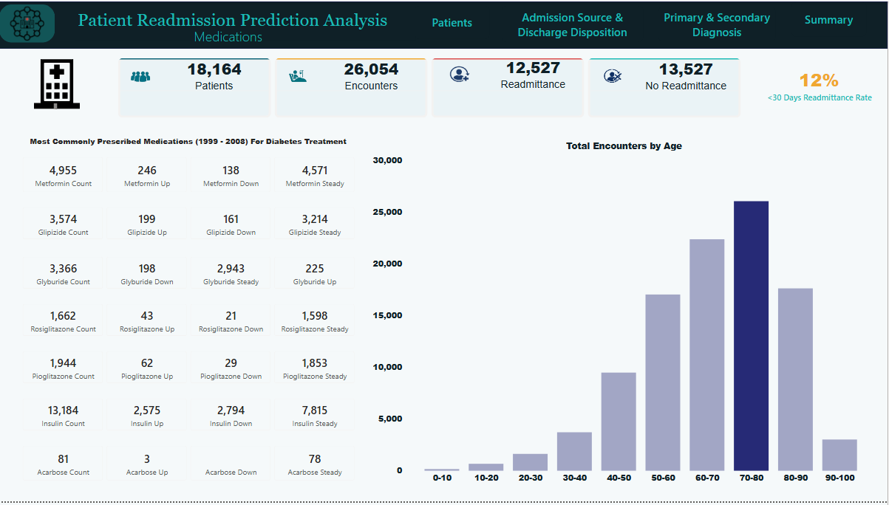

# Healthcare Management: Patient Readmission Prediction

_To empower healthcare providers to proactively intervene and prevent readmissions, thereby improving patient outcomes and reducing readmission cost._

## 🎯 Project Overview

Identify patients being readmitted to a healthcare facility within 30 days after being treated and discharged from the facility. Identify the treatment provided and through data analysis aid healthcare providers with how they can proactively intervene to prevent readmissions which can contribute to improvements to a patient’s outcome and reduce the cost of healthcare readmissions. Share findings with all levels of management of healthcare facilities.

## 🛠️ How to Use This Project

1. **Clone the repository**
   ```bash
   git clone https://github.com/wmsimien/healthcare_management_patient_readmission.git
   cd healthcare_management_patient_readmission
   ```
2. **Open Healthcare_Load_Bronze_Tables.ipynb notebook**

    This file contains:

      - Data Import
        
      - Connection to PostreSQL Database
        
3. **Open Load_Silver.sql**

   This file contains:

      - Data cleaning (from bronze tables to silver tables)
  
      - Data transformation (from bronze tables to silver tables)
  
      - Data Import (from bronze tables to silver tables)

4. **Open Load_Final_Tables.sql**

   This file contains:

      - Data cleaning (from silver tables to final tables)
  
      - Data transformation (from silver tables to final tables)
  
      - Data Import (from silver tables to final tables)

5. **Open Healthcare_Patient_Analysis_Queries.sql** 

      - Answer Business Questions using SQL Queries
   
6. **Open Healthcare_Patient_Analysis.ipynb notebook**

    This file contains:

      - Data Import

      - Data exploration

      - Connection to PostreSQL Database
  
7. **Connect the PostgreSQL Database to Power BI**

   - Open healthcare_patient_readmission_dashboard.pbix
   
8. **Using The Dashboard**
   ### Introduction
    <br>
   ###### Control-Click the icon in the upper left-hand corner to navigate you to the Patients page.

   ### Patients
    <br>
   ###### Breakdown of unique patients by age and gender.  Clicking each bar provides details for the specific age and gender or race and gender.  To navigage to a specific page, use control-click in the top naviagation bar.

    <br>
   ###### Breakdown of patient encounters by age and gender and rance and gender.

    <br>
   ###### Breakdown of total readmitted patients less than 30 days readmittance by age and gender and race and gender.

    <br>
   ###### Breakdown of total readmitted patients greater than 30 days readmittance by age and gender and race and gender.

     <br>
   ###### Breakdown of total no readmitted patients by age and gender and race and gender.

   ### Admission Source & Discharge Disposition
     <br>
   ###### Breakdown of the top 5 admission sources by which a patient's care journey begins and the top 5 discharge dispositions which determines the next level of patient care.

   ### Primary & Secondary Diagnosis
     <br>
   ###### Breakdown of the leading primary and secondary diagnoses by age.

   ### Medications
     <br>
     <br>
   ###### Breakdown of the top most commonly prescribed medication and medications for total encounters by age groups.

    
## 📧 Contact

- **Name:** Wanda M Avery
- **LinkedIn:** www.linkedin.com/in/wanda-simien-avery-48588a1bb
